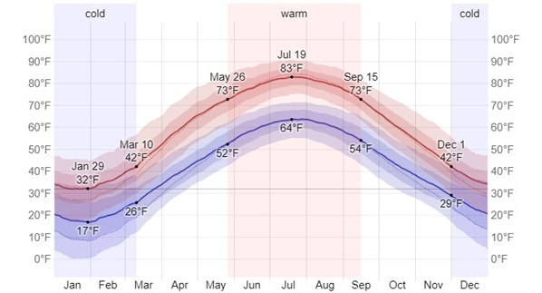
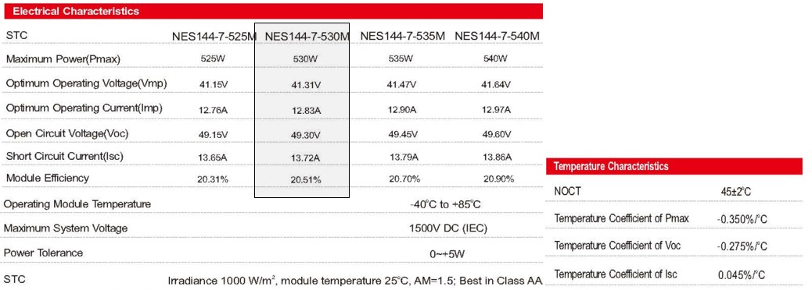
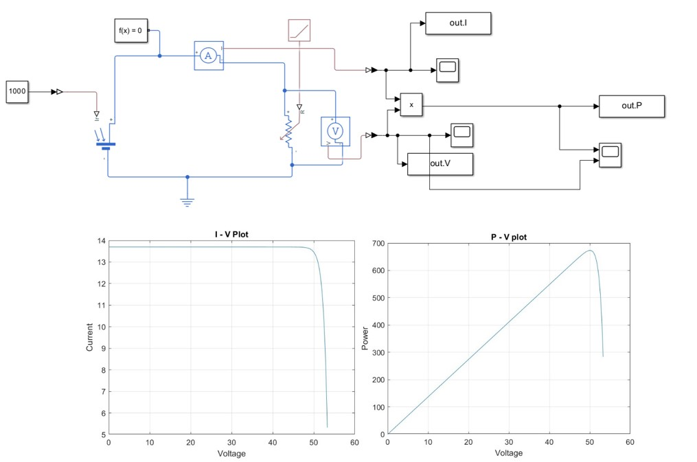
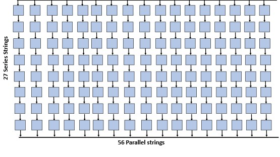
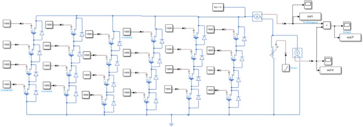
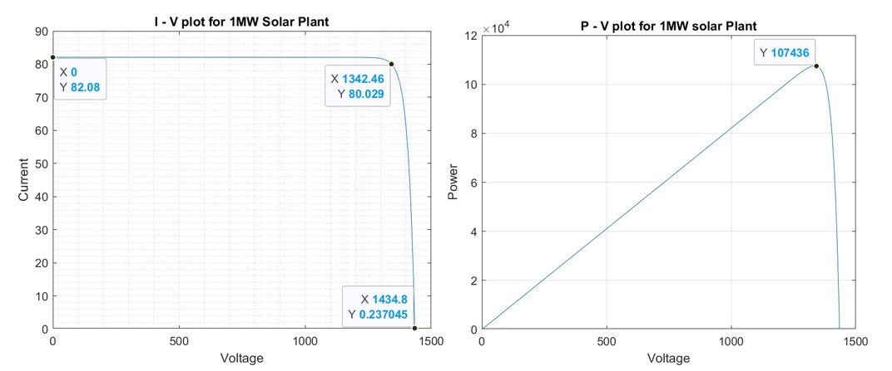
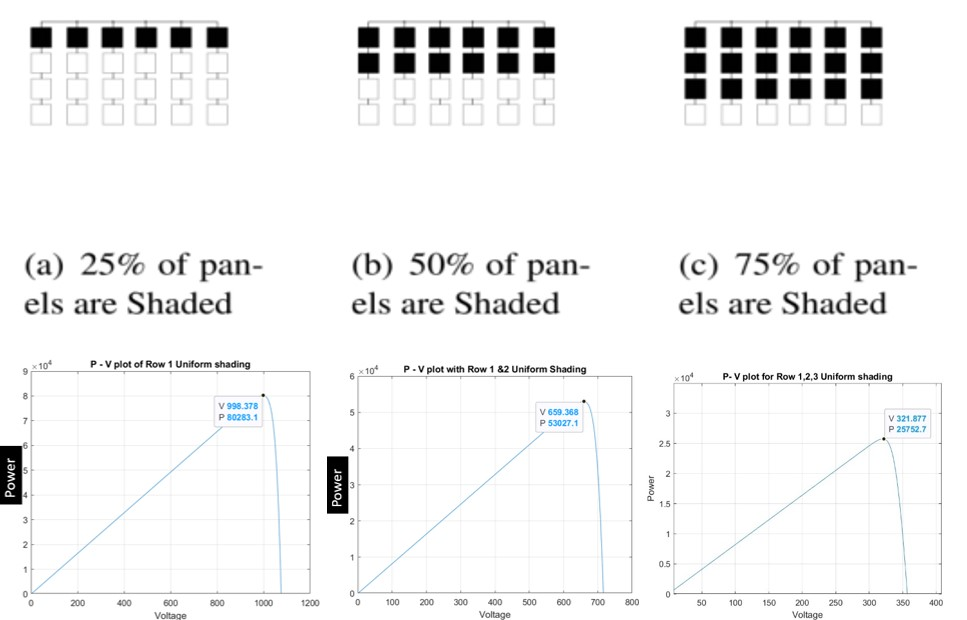
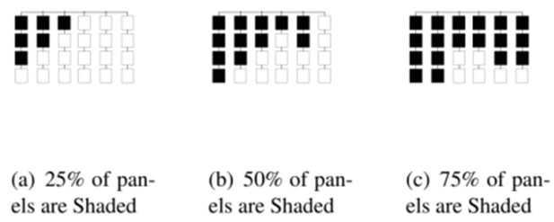

# 1MW 1500V Solar Array Design and Simulation

## Overview

This project focuses on the design and simulation of a 1 MW solar array for Albany, NY. The array is designed to meet the power requirements while staying within the maximum allowable DC voltage of 1500V. The project explores the impact of shading on the performance of the solar array and compares different Maximum Power Point Tracking (MPPT) techniques.

## Key Features

* **1 MW Solar Array Design:** Developed a comprehensive design for a 1 MW solar array.
* **Temperature Analysis:** Incorporated temperature data for Albany, NY, to accurately model PV panel behavior.
* **Shading Simulation:** Simulated the array under various shading conditions (uniform and non-uniform).
* **MPPT Comparison:** Analyzed and compared the performance of Central MPPT, MPPT per string, and MPPT per module.
* **Detailed I-V and P-V Characteristic Plots:** Generated plots for various shading scenarios and MPPT configurations.

## Project Sections

### Section 1: PV Panel Circuit Model

* Developed a PV panel circuit model based on the "NES144/525-530 W F 35mm MBB Half-cell Mono solar cell" datasheet.
* Calculated the Open Circuit Voltage (Voc) at the lowest temperature (-8°C).
* Determined the Maximum Power Voltage (VMPP) and Maximum Power Current (IMPP) at the highest temperature (28°C).
* Calculated the maximum power at 28°C.
* Temperature data was pulled from: [https://weatherspark.com/y/24883/Average-Weather-in-Albany-New-York-United-States-Year-Round](https://weatherspark.com/y/24883/Average-Weather-in-Albany-New-York-United-States-Year-Round)
    * 

**Calculations:**

1.  **Calculation of Open Circuit voltage at lowest temperature -8℃:**

    * The PV panel will get the highest voltage at the lowest temperature. By using the datasheets of the PV panels provided, I am using “NES144/525- 530 W F 35mm MBB Half-cell Mono solar cell “.
        * 

    * The following is the data of NES144-7-530M from the datasheet:
        * STC= 25℃ and 1000 W/m2
        * Open circuit voltage, Voc= 49.30V
        * Short circuit current, Isc= 13.72 A
        * Temp coefficient at Voc= -0.275 %/ C
        * Temp coefficient at Isc= 0.045%/ C
        * NOCT= 452 ℃
    * Now the Open circuit voltage at -8℃ is given by:
        * Voc =(Voc (at 25℃)) * (1+(Min.temp-25) * temperature coefficient(Voc))
        * = 49.30 * { 1+ [ (-8-25) * (-0.00275) ] } = 53.77 V

2.  **Calculation of the maximum Power Voltage VMPP at highest temperature 28℃:**

    * VMPP (28℃) =((Voc (at 25℃)) *(1+(Max.temp-25) * temperature coefficient (Voc))
    * VMPP (28℃) =49.30 * {1+ [ (28-25) * (-0.00275) ] } = 48.89 V

3.  **Calculation of the maximum Power Current IMPP at 28℃:**

    * Impp (28℃)= Isc(at 25) *(1+ ((Max temp - 25) * (temperature coefficient (Isc))))
    * = 13.72*{ 1+ [ (28 - 25)*(-0.00045)] }= 13.70 A

4.  **Maximum Power at 28℃:**

    * Pmpp= Vmpp * Impp= 48.89 * 13.70 = 669.793 W= 670W
        * 

### Section 2: Array Design

* Determined the total number of panels required for 1 MW power.
* Calculated the number of series modules required to meet the maximum voltage limit.
* Calculated the number of parallel strings required to meet the power demand.

**Calculations:**

* **Determining total number of Panels required for 1 MW power:**

    * The rated power is 1MW, each panel generates 670 W.
    * Total number of panels required = 1000000W / 670W = 1492.79 (rounding up) = 1493 panels

* **Determining how many series modules are required:**

    * Given that the maximum voltage limit is 1500 V. At coldest temperature there will be high voltage.
    * Based on the above PV panel designed with a Voc of 53.77 V, we need to add the designed PV panel in series so that it will not cross the maximum limit.
    * No. of series strings required = 1500V / 53.77V = 27.89 (rounding down) = 27 modules in series are required to make 1 Series string
    * If the value are rounded up the voltage will be 1505V (28 * 53.77) which is not acceptable.
    * Rounding down 27.87 to 27 panels would be better, with this the voltage will be nearly 1500 V i.e., 1451 V.

* **Determining how many Parallel strings are required:**

    * No. of parallel strings required to meet 1MW power = 1493 panels / 27 panels per string = 55.29 (rounding up)
    * No. of Parallel strings required 56 parallel strings.
        * 

### Section 3: Shading Analysis

* Simulated the scaled-down model of the array under uniform and non-uniform shading conditions.
* Analyzed the impact of different percentages of shading (25%, 50%, and 75%) on the I-V and P-V characteristics of the array.
* Shading scenarios included:
    * Uniform Shading
    * Non-Uniform Shading

**Detailed Shading Analysis:**

In this section, we will discuss how the voltage and current are going to change under:

i) Uniform shading conditions
ii) Non-Uniform shading conditions

I have designed a scaled-down version of PV arrays with 4 series and 6 Parallel strings to meet the rated power and voltage consideration.
     

     

**Uniform Shading:**

In uniform shading conditions, the I – V and P – V plots will not be disturbed. The magnitudes will be changed according to how many rows are shaded. Let’s see in detail with different rows shaded.
     

**Non–Uniform Shading:**

In non-uniform shading conditions, the PV arrays are shaded randomly so that the variations in voltage and power are different. Let’s see in detail.
     

     
<img src="Images/nonunimat.jpg

## Project Structure

* **Documentation**: Contains project-related documents.
    * `Final Project ES.pdf`: Contains detailed calculations, plots, and analysis.
    * `IECE513_project.pdf`: Project requirements and specifications.
* **Matlab**: Contains MATLAB simulation files and scripts.
    * `MPPT/`: Contains files related to Maximum Power Point Tracking analysis.
    * `PV_panel/`: Contains files related to the PV panel model and characteristics.
    * `Shading conditions/`: Contains files related to shading simulations and analysis.

  
## Acknowledgments

This project was completed as part of the ECE 513 course at the University at Albany.

## Contact

For any questions or further information, please contact akhilreddy1607@gmail.com.

